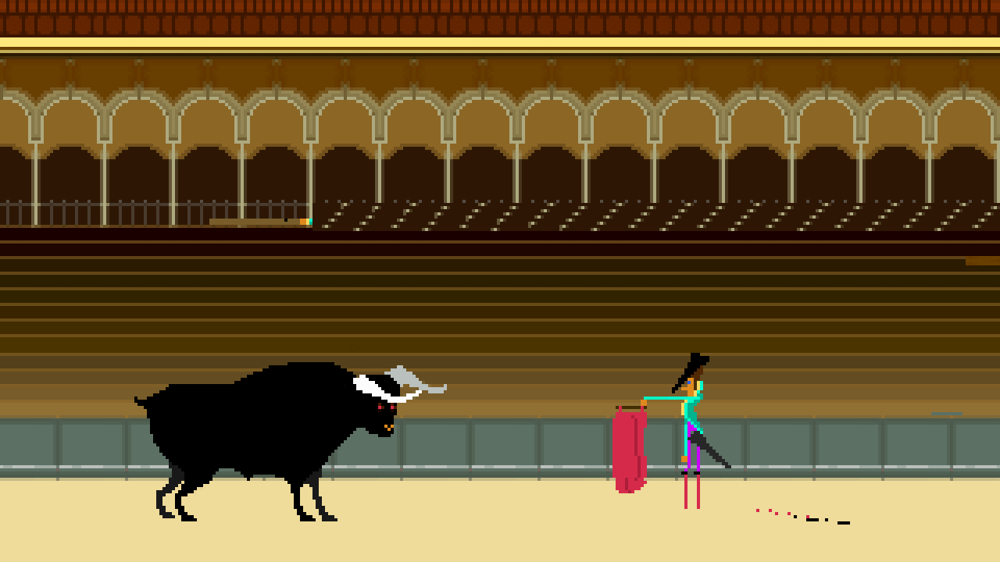

#  Press X to Give Up

Click the game to start. Play with music (headphones).

This game is about fighting a bull. Change stance (SPACE) when the bull is near. Immediately pull up your banderilla (HOLD UP ARROW) and stab the bull right behind the head (HOLD DOWN ARROW). Run away (LEFT/RIGHT ARROW) whenever you get the chance.

This is an update of the original, ported by [Steve Richey](https://twitter.com/stvr_tweets) to [HaxeFlixel](http://www.haxeflixel.com) with help from [Jonatan Van Hove](https://twitter.com/joonturbo).

[Original game](http://joon.be/toy/pressx/) by:
* [Anders Boerup]() who did the audio.
* [Bram Michielsen](https://twitter.com/brammichielsen) who did story, and has a webcomic [A Song Called City](http://asongcalledcity.com/).
* [Henrike Lode](https://twitter.com/machineers) who did art, and has worked on [Machineers](http://machineers.tumblr.com/). 
* [Jonas Maaloe](https://twitter.com/jonasmaaloe) who did concept and touchups and has worked on [LAZA KNITEZ](http://lazaknitez.com/)!! 
* [Jonatan Van Hove](https://twitter.com/joonturbo) who did programming, and has also worked on [LAZA KNITEZ](http://lazaknitez.com/)!! 
* [Mads Johansen](https://twitter.com/pyjamads) who did programming, and has worked on [LAZA KNITEZ](http://lazaknitez.com/)!!

Press X to Give Up is (C) 2013 Anders Børup, Bram Michielsen, Henrike Lode, Jonas Maaløe, Jonatan Van Hove, Mads Johansen, and Thomas Ryder.